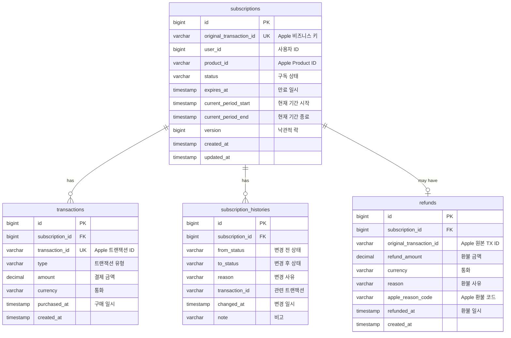

# ERD (Entity Relationship Diagram)

## 다이어그램



---

## 테이블 정의

### subscriptions (구독)

| Column | Type | Constraints | Description |
|--------|------|-------------|-------------|
| id | BIGINT | PK, AI | 내부 식별자 |
| original_transaction_id | VARCHAR(100) | NN, UQ | Apple 제공 비즈니스 키 |
| user_id | BIGINT | NN | 사용자 ID |
| product_id | VARCHAR(100) | NN | Apple Product ID (Embedded) |
| status | VARCHAR(20) | NN | ACTIVE, EXPIRED, GRACE_PERIOD 등 |
| expires_at | TIMESTAMP | NN | 구독 만료 일시 |
| current_period_start | TIMESTAMP | NN | 현재 구독 기간 시작 |
| current_period_end | TIMESTAMP | NN | 현재 구독 기간 종료 |
| version | BIGINT | | 낙관적 락 (JPA @Version) |
| created_at | TIMESTAMP | NN | 생성 일시 |
| updated_at | TIMESTAMP | NN | 수정 일시 |

**Indexes:**
- `idx_subscription_original_tx_id`: original_transaction_id (UNIQUE)
- `idx_subscription_user_id`: user_id
- `idx_subscription_status`: status
- `idx_subscription_expires_at`: expires_at

---

### transactions (트랜잭션)

| Column | Type | Constraints | Description |
|--------|------|-------------|-------------|
| id | BIGINT | PK, AI | 내부 식별자 |
| subscription_id | BIGINT | NN, FK | 구독 ID |
| transaction_id | VARCHAR(100) | NN, UQ | Apple 트랜잭션 ID |
| type | VARCHAR(20) | NN | PURCHASE, RENEWAL, REFUND, UPSELL |
| amount | DECIMAL(19,4) | | 결제 금액 (Embedded VO) |
| currency | VARCHAR(3) | | 통화 코드 |
| purchased_at | TIMESTAMP | NN | 구매/결제 일시 |
| created_at | TIMESTAMP | NN | 생성 일시 |

**Indexes:**
- `idx_transaction_tx_id`: transaction_id (UNIQUE)
- `idx_transaction_subscription_id`: subscription_id
- `idx_transaction_type`: type
- `idx_transaction_purchased_at`: purchased_at

**Foreign Keys:**
- `fk_transaction_subscription`: subscription_id → subscriptions(id)

---

### subscription_histories (구독 상태 변경 이력)

| Column | Type | Constraints | Description |
|--------|------|-------------|-------------|
| id | BIGINT | PK, AI | 내부 식별자 |
| subscription_id | BIGINT | NN, FK | 구독 ID |
| from_status | VARCHAR(20) | NN | 변경 전 상태 |
| to_status | VARCHAR(20) | NN | 변경 후 상태 |
| reason | VARCHAR(50) | | 변경 사유 (Apple 이벤트 타입) |
| transaction_id | VARCHAR(100) | | 관련 트랜잭션 ID |
| changed_at | TIMESTAMP | NN | 변경 일시 |
| note | VARCHAR(500) | | 비고 |

**Indexes:**
- `idx_history_subscription_id`: subscription_id
- `idx_history_changed_at`: changed_at

**Foreign Keys:**
- `fk_history_subscription`: subscription_id → subscriptions(id)

---

### refunds (환불 정보)

| Column | Type | Constraints | Description |
|--------|------|-------------|-------------|
| id | BIGINT | PK, AI | 내부 식별자 |
| subscription_id | BIGINT | NN, FK | 구독 ID |
| original_transaction_id | VARCHAR(100) | NN | Apple 원본 트랜잭션 ID |
| refund_amount | DECIMAL(19,4) | NN | 환불 금액 (Embedded VO) |
| currency | VARCHAR(3) | NN | 통화 코드 |
| reason | VARCHAR(30) | | USER_REQUEST, APPLE_APPROVED 등 |
| apple_reason_code | VARCHAR(50) | | Apple 환불 사유 코드 |
| refunded_at | TIMESTAMP | NN | 환불 처리 일시 |
| created_at | TIMESTAMP | NN | 생성 일시 |

**Indexes:**
- `idx_refund_subscription_id`: subscription_id
- `idx_refund_refunded_at`: refunded_at

**Foreign Keys:**
- `fk_refund_subscription`: subscription_id → subscriptions(id)

---

## Value Objects (Embedded)

### Money
| Attribute | Type | Description |
|-----------|------|-------------|
| amount | BigDecimal | 금액 |
| currency | Currency | 통화 |

### Period
| Attribute | Type | Description |
|-----------|------|-------------|
| startAt | Instant | 시작 시간 |
| endAt | Instant | 종료 시간 |

### ProductId
| Attribute | Type | Description |
|-----------|------|-------------|
| value | String | Apple Product ID |

### WebhookEvent
| Attribute | Type | Description |
|-----------|------|-------------|
| notificationType | String | Apple 이벤트 타입 |
| transactionId | String | 트랜잭션 ID |
| originalTransactionId | String | 원본 트랜잭션 ID |
| productId | String | 제품 ID |
| signedDate | Instant | 서명 일시 |
| expiresDate | Instant | 만료 일시 |
| environment | String | 환경 (SANDBOX/PRODUCTION) |

---

## SQL Schema

```sql
-- subscriptions 테이블
CREATE TABLE subscriptions (
    id BIGINT AUTO_INCREMENT PRIMARY KEY,
    original_transaction_id VARCHAR(100) NOT NULL UNIQUE,
    user_id BIGINT NOT NULL,
    product_id VARCHAR(100) NOT NULL,
    status VARCHAR(20) NOT NULL,
    expires_at TIMESTAMP NOT NULL,
    current_period_start TIMESTAMP NOT NULL,
    current_period_end TIMESTAMP NOT NULL,
    version BIGINT,
    created_at TIMESTAMP NOT NULL DEFAULT CURRENT_TIMESTAMP,
    updated_at TIMESTAMP NOT NULL DEFAULT CURRENT_TIMESTAMP ON UPDATE CURRENT_TIMESTAMP,

    INDEX idx_subscription_user_id (user_id),
    INDEX idx_subscription_status (status),
    INDEX idx_subscription_expires_at (expires_at)
) ENGINE=InnoDB DEFAULT CHARSET=utf8mb4;

-- transactions 테이블
CREATE TABLE transactions (
    id BIGINT AUTO_INCREMENT PRIMARY KEY,
    subscription_id BIGINT NOT NULL,
    transaction_id VARCHAR(100) NOT NULL UNIQUE,
    type VARCHAR(20) NOT NULL,
    amount DECIMAL(19,4),
    currency VARCHAR(3),
    purchased_at TIMESTAMP NOT NULL,
    created_at TIMESTAMP NOT NULL DEFAULT CURRENT_TIMESTAMP,

    INDEX idx_transaction_subscription_id (subscription_id),
    INDEX idx_transaction_type (type),
    INDEX idx_transaction_purchased_at (purchased_at),
    CONSTRAINT fk_transaction_subscription FOREIGN KEY (subscription_id) REFERENCES subscriptions(id)
) ENGINE=InnoDB DEFAULT CHARSET=utf8mb4;

-- subscription_histories 테이블
CREATE TABLE subscription_histories (
    id BIGINT AUTO_INCREMENT PRIMARY KEY,
    subscription_id BIGINT NOT NULL,
    from_status VARCHAR(20) NOT NULL,
    to_status VARCHAR(20) NOT NULL,
    reason VARCHAR(50),
    transaction_id VARCHAR(100),
    changed_at TIMESTAMP NOT NULL,
    note VARCHAR(500),

    INDEX idx_history_subscription_id (subscription_id),
    INDEX idx_history_changed_at (changed_at),
    CONSTRAINT fk_history_subscription FOREIGN KEY (subscription_id) REFERENCES subscriptions(id)
) ENGINE=InnoDB DEFAULT CHARSET=utf8mb4;

-- refunds 테이블
CREATE TABLE refunds (
    id BIGINT AUTO_INCREMENT PRIMARY KEY,
    subscription_id BIGINT NOT NULL,
    original_transaction_id VARCHAR(100) NOT NULL,
    refund_amount DECIMAL(19,4) NOT NULL,
    currency VARCHAR(3) NOT NULL,
    reason VARCHAR(30),
    apple_reason_code VARCHAR(50),
    refunded_at TIMESTAMP NOT NULL,
    created_at TIMESTAMP NOT NULL DEFAULT CURRENT_TIMESTAMP,

    INDEX idx_refund_subscription_id (subscription_id),
    INDEX idx_refund_refunded_at (refunded_at),
    CONSTRAINT fk_refund_subscription FOREIGN KEY (subscription_id) REFERENCES subscriptions(id)
) ENGINE=InnoDB DEFAULT CHARSET=utf8mb4;
```

---

## 샘플 데이터

```sql
-- 구독 샘플
INSERT INTO subscriptions (original_transaction_id, user_id, product_id, status, expires_at, current_period_start, current_period_end)
VALUES ('1000000123456789', 1, 'com.example.pro.monthly', 'ACTIVE', '2026-03-24 00:00:00', '2026-02-24 00:00:00', '2026-03-24 00:00:00');

-- 트랜잭션 샘플
INSERT INTO transactions (subscription_id, transaction_id, type, amount, currency, purchased_at)
VALUES (1, '1000000123456790', 'PURCHASE', 9.99, 'USD', '2026-02-24 10:00:00');

-- 상태 변경 이력 샘플
INSERT INTO subscription_histories (subscription_id, from_status, to_status, reason, transaction_id, changed_at)
VALUES (1, NULL, 'ACTIVE', 'SUBSCRIBED', '1000000123456790', '2026-02-24 10:00:00');
```
